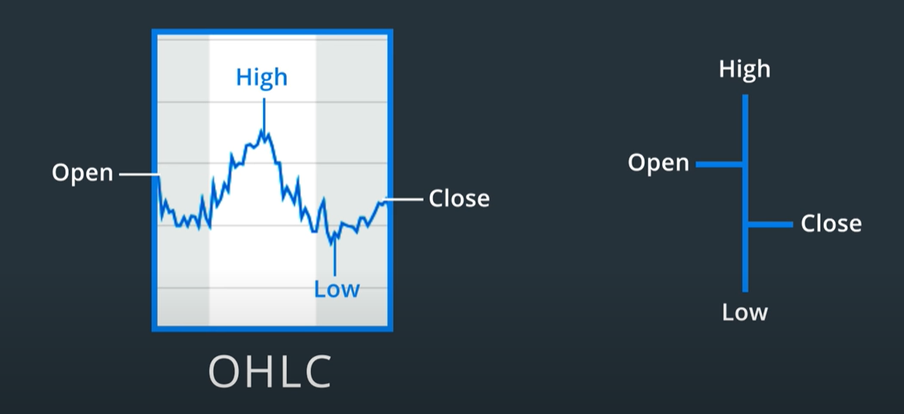

### Market Dynamics

Market generates the data every second, day and week. The data visualization is prepared on basis of daily movement, weekly movement or monthly movement by implementing moving average method. 

-  An OHLC chart is a type of bar chart that shows open, high, low, and closing prices for each period. OHLC charts are useful since they show the four major data points over a period, with the closing price being considered the most important by many traders.

-  Volume measures the number of shares traded in a stock or contracts traded in futures or options. Volume can be an indicator of market strength, as rising markets on increasing volume are typically viewed as strong and healthy. When prices fall on increasing volume, the trend is gathering strength to the downside.

-  Market cap—or market capitalization—refers to the total value of all a company's shares of stock. It is calculated by multiplying the price of a stock by its total number of outstanding shares. For example, a company with 20 million shares selling at \$50 a share would have a market cap of \$1 billion

-  The P/E ratio shows what the market is willing to pay today for a stock based on its past or future earnings. A high P/E could mean that a stock's price is high relative to earnings and possibly overvalued. Conversely, a low P/E might indicate that the current stock price is low relative to earnings.
