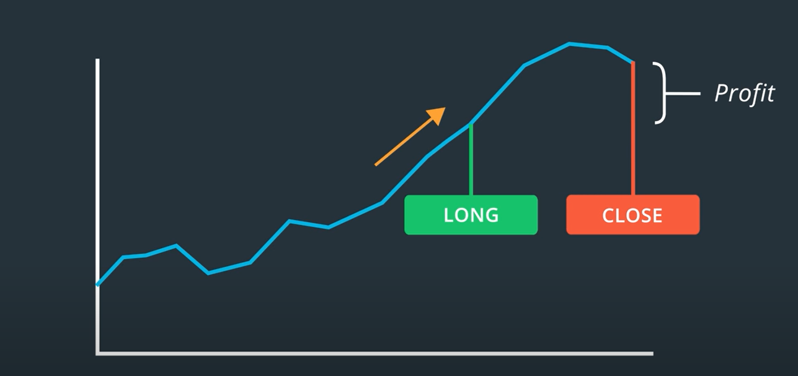

### Momentum Trading
A trading strategy is a set of rules that helps to decide what stock to buy or sell, when to perform these trades and how much money to invest in them.Designing a successful trading strategy that reliably generates profits while minimizing the risk of losing money is indeed a complex task. It starts with looking for signals that might hold a clue about the future performance of stocks. Where do we find such signals? There is nothing famous for trading signals that globally works in all cases. You need to develop your own strategy through market stimuli (News, media sentiment, company progress etc). It is important to treat it as a hypothesis and test it against data to see if it holds up.This will allow you to build a strong foundation for your trading strategy.

**Momentum Based Trading Theory** : Newton's law in stock market momentum encourage us to guess rising stock market keep rising for some time while falling stock price continues to fall for some time. Few common techniques to identify momentum based trading opportunities includes
    
    

  
- Moving averages
- Large Price Movement with Volume
- Stocks making new heights
    
    
**Long or Short Position**: If you think that a stock has upward momentum, you might want to buy some shares and hold onto it for a fixed period of time.This is called the "LONG" position on the stock.You might want to sell it at a point which is called closing your position.
    

    
Similarly, in case of stock is falling downward, you can take "SHORT" position. Which means you can sell first at higher price and buy it later in lower price (close). This becomes possible by burrowing stocks from broker and returning them once you close the position.Broker typically earns commission from the profit you make from the short sales.
    
    

    
In summary, a portfolio is a collection of investments held and/or managed by an investment company, hedge fund, financial institution or individual. A long (or long position) is the purchase of an asset under the expectation that the price of the asset will rise. A short (or short position) is the selling of an asset under the expectation that the price of the asset will decline. In practice, an investor profits from a short position by borrowing shares from a brokerage firm (agreeing to pay an interest rate as a fee), selling them on the open market, and later buying them back on the open market at a lower price and returning them to the brokerage firm.

**Momentum Based Trading Strategy** : In order to formulate complete trading strategy, one need to classify stocks in the portfolio into long and short position. The selection process of the stocks to go into the portfolio is based on stock's return performance relative to the other stocks. This step is conducted every month end periodically re-evaluating and re-balancing stock holding. 

    
!img

    
In order to re-balancing the portfolio in Long and Short list, one need to create a log return withing the selected period (month) and sort the stock based on that return. Top list goes to Long while bottom list goes to Short.

